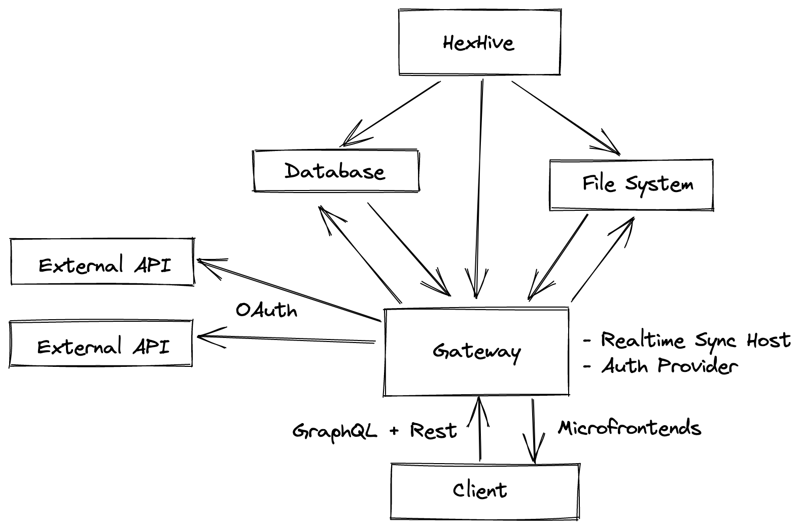

# HexHive Architecture

This document serves to give a broad outline of the plumbing to create HexHive Services

## Overview

## Core Components

### `Gateway`

The gateway serves federated appliances with a microfrontend approach to allow building networked systems.
The gateway provides a consistent auth source and delegates routing to federated modules

Each request to a federated module is passed a X-Hive-JWT header which can be verified with the public key available at /.well-known/jwks.json

### `Appliance`

An external frontend that exposes a bootstrap, mount method and a remoteEntrypoint

### `Database`

- Timseries
- RDBMS
- Graph Query
- JSONb

### `File System`

Consistent decentralized file store shared between HexHive appliances
