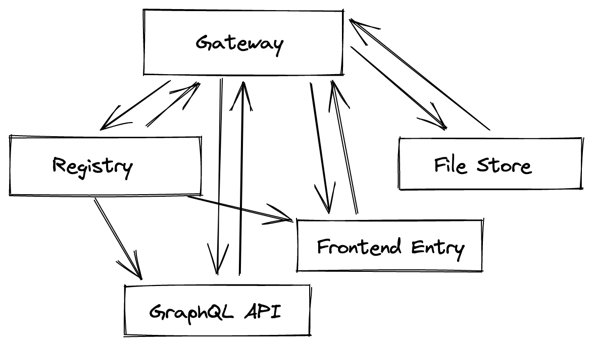

# HexHive Gateway

## Components

### Frontend server

- Microfrontend registry
- Route based application mounting

### GraphQL Engine


### File Gateway

## Get Started

Create a .env file with the following keys

```
AUTH_SERVER=$OPENID_SERVER

IPFS_URL=$IPFS_URL
IPFS_GATEWAY=$IPFS_GATEWAY

UI_URL=http://localhost:3000/dashboard
BASE_URL=http://localhost:7000

REDIRECT_URI=http://localhost:7000/callback

NEO4J_USER=
NEO4J_PASSWORD=
NEO4J_URI=

RABBIT_URL=

TIMESERIES_HOST=
TIMESERIES_USER=
TIMESERIES_PASSWORD=

AWS_ACCESS_KEY_ID=
AWS_SECRET_ACCESS_KEY=

KAFKA_URL=

```

Start the backend
```
yarn start
```

## Architecture


